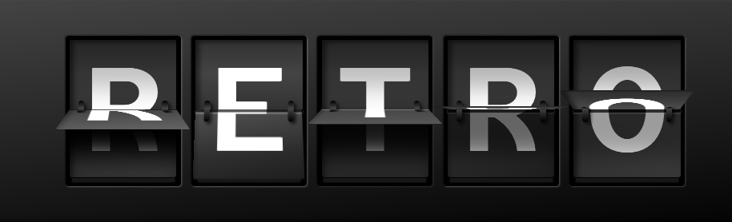

<h1 align="center" style="border-bottom:none;"> Reading and spellling tool without rainbow/cartoon kiddie clutter </h1>

  

  Pure JS/CSS/Speach Synthisis/Material Icons

No images are used (except for the screenshots in this readMe). 

Webster Elementary API for definitions and sylable brakdowns

### Words : Do do and Improvements needed

- [x] display random word
- [x] display in a readable, fun, interesting way
- [x] use multiple db's for source (currently local arrays)
- [x] use Webster dictionairy for definitions and pronunciation
- [ ] display (multiple) definitions
- [x] speakable definitions
- [x] change to random bg color on each new word
- [x] change background color to match word if CSS colors db is in use
- [x] speak word with voice of choice
- [x] user choose new word with click
- [x] user choose upper case, lower case, capitolize
- [x] user choose witch db for source
- [x] user choose dificulty (word length)
- [x] user choose voice, rate and pitch for synth voice
- [ ] use API for word, instead of local array in a file?
      works, but diffifult words are often chosen
- [ ] allow user to input list of their own pertnent words
- [x] hilight letters on hover (teaching aid)
- [x] keep hilighted on click (for sectional pronunciation)
- [x] adjust # of characters displayed for vw
- [ ] adjust MAX # of characters searched for word to match # of characters displayed
- [ ] adjust # of characters for vw, scale min/max
      scale down as much as 70% to allow more characters to fit smaller screens
      scaling begins at 6 characters
- [ ] add horizontal 'windodw shade' to pull from left/right to cover letters
- [ ] add horizontal bars under letters to group by syllables
- [x] add 'dark mode' or collors on/off
- [x] click-to-pronounce syllables
- [ ] click-to-pronounce pronunciation characters
